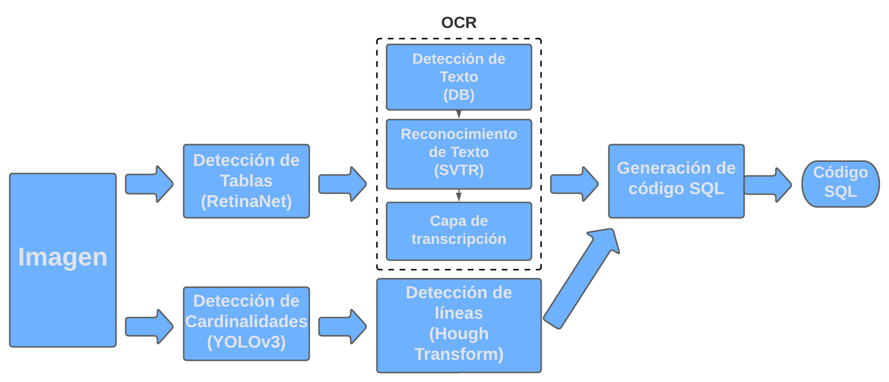

# TFI-Cazcarra
Converting ER Diagrams to .sql scripts using neural networks.

## Pipeline

<div align="center">
    
</div>

## Predictions
For predicting an image, the steps are the following:

1) Create an environment and install the packages in requirements.txt
2) Download the models. See models/ for more info.
3) Execute predict.py

Example usage:

```
python predict.py --img_path ./imagenes/imagen.png --path_to_save ./resultados/resultados_imagen.sql
```

## Example

Executing this ERD through the system

<div align="center">
    
</div>
<br>

results into this SQL code:

```
CREATE TABLE tokens ( 
  token_id INT(11),
  token CHAR(64),
  user_id INT(11),
  token_expires DATETIME,
  PRIMARY KEY (token_id) 
); 
CREATE TABLE poems ( 
  poem_id INT(11),
  title VARCHAR(200),
  poem TEXT,
  date_submitted DATETIME,
  category_id INT(11),
  user_id INT(11),
  date_approved DATETIME,
  PRIMARY KEY (poem_id) 
); 
CREATE TABLE categories ( 
  category_id INT(11),
  category VARCHAR(100),
  PRIMARY KEY (category_id) 
); 
CREATE TABLE users ( 
  user_id INT(11),
  first_name VARCHAR(50),
  last_name VARCHAR(50),
  email VARCHAR(100),
  username VARCHAR(30),
  pass_phrase VARCHAR(500),
  is_admin TINYINT(4),
  date_registered DATETIME,
  profile_pic VARCHAR(30),
  registration_confirmed TINYINT(4),
  PRIMARY KEY (user_id) 
); 
ALTER TABLE tokens ADD FOREIGN KEY (user_id) REFERENCES users(user_id); 
ALTER TABLE poems ADD FOREIGN KEY (user_id) REFERENCES users(user_id); 
ALTER TABLE poems ADD FOREIGN KEY (category_id) REFERENCES categories(category_id);
```
